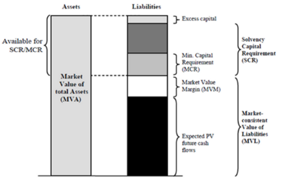
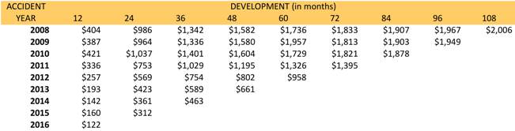

```{r knitr_init, echo = FALSE, results = "asis", cache = FALSE}
library(knitr)
library(rmdformats)

## Global options
options(max.print = "75")
opts_chunk$set(echo    = TRUE,
               cache   = FALSE,
               prompt  = FALSE,
               tidy    = FALSE,
               comment = NA,
               message = FALSE,
               warning = FALSE)
opts_knit$set(width = 75)
```


```{r fig.show = "hold", out.width = "25%", out.extra='style="float:right; padding:10px"', echo = FALSE}

```

# Introduction
## Contents
1. Introduction to Reserving
2. Reserving methods 
3. How to go from a raw claims dataset to a triangle, ensure that you have a historical vision of a claim in order to create the triangle, claim occurance date, date of payment and paid amount
4. How to change from basic chainladder to other methods
5. ChainLadder in Python  
6. Questions  

# What is Reserving, why is it important? {.tabset .tabset-fade}

A claims reserve is a reserve of money that is set aside by an insurance company in order to pay policyholders who have filed or are expected to file legitimate claims on their policies. The claims reserve is also known as the balance sheet reserve. *(investopedia)*  

```{r fig.show = "hold", out.width = "50%", out.extra='style="float:right; padding:10px"', echo = FALSE}


```

This feeds into the Best Estimate Liabilities calculation (Note: SCR it’s the European regulation, in the US they have something different)  

```{r fig.show = "hold", out.width = "50%",  out.width = "50%", fig.align = "right", echo = FALSE}

```

<br/>
<br/>
<br/>
<br/>

# Reserving methods {.tabset .tabset-fade}
1. Chain Ladder Method
2. Bornhuetter/Ferguson Method
3. Mack ChainLadder
4. Munich ChainLadder
5. Bootstrap ChainLadder
6. Multivariate ChainLadder
7. Clark’s LDF method


**Let's get to the coding**

# Create Triangles {.tabset .tabset-fade}

Setup Code and Load Data

## Setting up our environment

First we load all our packages that we need.

```{r}
# Setup and Load Packages -------------------------------------------------
options(scipen = 999)
if (!is.element("yaml",     .packages(all.available = TRUE))) install.packages("yaml")
if (!is.element("devtools", .packages(all.available = TRUE))) install.packages("devtools")

for (func in list.files(path = "1_code/0_functions/", full.names = TRUE)) source(func)

# Load Meta data
metaData <- yaml::read_yaml(file = "metadata.yaml")

devtools::install_github(repo = metaData$connectionDetails$github$repo, auth_token = metaData$connectionDetails$github$token)
eaR::utl_pkgInstaller(libs = c("tidyverse", "lubridate"), destinationFolder = "C:/Users/a009831/Documents/rlibraries")
```

## Loading and prepping the data {.tabset .tabset-fade}

I use a made up dataset in my example but there are example triangles in the chainladder package.
I prepare my data with Quarterly information but you can change this depending on your needs.

```{r}
# Insurance Claims data ----------------------------------------------------
dat <- readr::read_csv("0_data/demoData.csv")
head(dat) %>% kablePretty()

# Prep the data for your triangle by creating quarterly information to view development periods at a more granular level
dat <- dat %>% 
  mutate(claimDate = lubridate::dmy(claimDate),
         paidDate = lubridate::dmy(paidDate),
         claimQ = lubridate::quarter(claimDate, with_year = TRUE),
         paidQ = lubridate::quarter(paidDate, with_year = TRUE))

head(dat) %>% kablePretty()
```

## Preprep functions for Triangles {.tabset .tabset-fade}

First function creates the cumulative triangle using the three columns of input data

```{r}
# function to create the cumulative triangle
# Must have claimDate, paidDate, paidAmount

cumtriangleFunc <- function(data) {
  # prep the dates and calculating the development period
  prep <- data %>% 
    dplyr::mutate(claimQY = lubridate::quarter(claimDate, with_year = TRUE),
                  claimQ = lubridate::quarter(claimDate),
                  claimYear = lubridate::year(claimDate),
                  paymentQ = lubridate::quarter(paidDate),
                  yearDiff = lubridate::year(paidDate) - lubridate::year(claimDate),
                  quarterDiff = paymentQ - claimQ,
                  devPeriod = ((yearDiff * 4) + quarterDiff)) %>%
    dplyr::group_by(claimYear, claimQY, devPeriod) %>%
    dplyr::summarise(paidAmount = sum(paidAmount))
  # Create a Mapping table for the claim years
  year <- sort(unique(prep$claimYear), decreasing = FALSE)
  yearmapping <- seq(0,length(unique(prep$claimYear)) - 1, by = 1)
  yearMultiplier <-  cbind.data.frame(year, yearmapping)
  
  prep <- prep %>%
    dplyr::group_by(claimQY, devPeriod) %>%
    dplyr::summarise(paidAmount = sum(paidAmount, na.rm = TRUE))
  
  minDt <- data$claimDate %>% min()
  maxDt <- data$claimDate %>% max()
  
  quarterRef <- tibble(dates = seq(minDt, maxDt, by = "month"),
                       claimQY = lubridate::quarter(dates, with_year = TRUE)) %>%
    select(claimQY) %>%
    distinct() %>%
    mutate(qtr = row_number())
  
  tri <- tibble(claimQY = quarterRef$claimQY %>% rep(nrow(quarterRef))) %>%
    arrange(claimQY) %>%
    mutate(devPeriod = seq(0, nrow(quarterRef) - 1, 1) %>% rep(nrow(quarterRef))) %>%
    left_join(prep) %>%
    mutate(paidAmount = ifelse(is.na(paidAmount), 0, paidAmount)) %>%
    dplyr::ungroup() %>%
    dplyr::group_by(claimQY) %>%
    left_join(quarterRef) %>%
    ChainLadder::as.triangle(origin = "claimQY", dev = "devPeriod", value = "paidAmount")
  
  # Flip triangle from left to right to get lower left triangle to be NA
  tri <- pracma::fliplr(tri)
  # Make the lower left triangle NA
  tri[lower.tri(tri)] <- NA
  # Flip triangle back to the right way
  tri <- pracma::fliplr(tri)
  
  #cum tri
  cumTri <- ChainLadder::incr2cum(Triangle = tri)
  return(cumTri)
}
```

Next function fills out the lower triangle using the weighted averages to predict the rest of the development periods

```{r}
# function to create the age to age factors and create the classic chainladder
# Give the function your cumulative triangle post fixes to nonfull months
fillLowTriFunc <- function(cumTri) {
  
  # Calculate Age to Age factors - Triangle
  ageToAge <- ChainLadder::ata(Triangle = cumTri)
  ageToAge[is.infinite(ageToAge)] <- 0
  
  # Volume weighted averages
  vwtd <- attr(ChainLadder::ata(cumTri), "vwtd")
  
  # For loop to fill in the lower triangle
  for (jj in 2:ncol(cumTri)) {
    cumTri[, jj][is.na(cumTri[, jj])] <- cumTri[, jj - 1][is.na(cumTri[, jj])] * vwtd[jj - 1]
  }
  
  # Sum of the diagonal
  latest <- cumTri %>%  pracma::fliplr() %>% diag() %>% sum()
  
  # Sum of the full years 
  ultimate <- cumTri[,ncol(cumTri)] %>% sum()
  
  # Calculate the IBNR
  IBNR <- ultimate - latest

  return(cumTri)
}
```
Final function prints some statistics that might be useful

```{r}
# function to return the stats about chainladder
# Give the function your final triangle
triStatsFunc <- function(finTri) {

# Sum of the diagonal
latest <- finTri %>%  pracma::fliplr() %>% diag() %>% sum()

# Sum of the full years 
ultimate <- finTri[,ncol(finTri)] %>% sum()

# Calculate the IBNR
IBNR <- ultimate - latest

results <- list(paste0("Latest = ", latest), paste0("Ultimate = ", ultimate), paste0("IBNR = ", IBNR))
return(results)

}
```

## Triangles {.tabset .tabset-fade}

```{r}
# Create my cumulative triangle
cumTri <- cumtriangleFunc(dat)
cumTri

# Mack Chainladder method using ChainLadder package
mackTri <- ChainLadder::MackChainLadder(Triangle = cumTri)
mackTri

# Fill in lower triangle
Tri <- fillLowTriFunc(cumTri)
Tri

# Calculate Age to Age factors - Triangle
ageToAge <- ChainLadder::ata(Triangle = cumTri)
ageToAge[is.infinite(ageToAge)] <- 0
ageToAge
# write.csv(x = ageToAge, file = "ageToAge.csv")

# Volume weighted averages
vwtd <- attr(ChainLadder::ata(cumTri), "vwtd")
vwtd
# write.csv(x = vwtd, file = "vwtd.csv")

# smpl <- attr(ChainLadder::ata(cumTri), "smpl")
# write.csv(x = smpl, file = "smpl.csv")

# plot
plot(mackTri, legend = FALSE)
plot(mackTri, lattice = TRUE)
plot(cumTri)

# Get stats on Triangle
TriStats <- triStatsFunc(Tri)
TriStats

# Export cumTriangle, it's best to export this as a csv to keep the shape of the triangle in Excel
# write.csv(x = cumTri, file = "2_results/cumTri.csv")

# Export finTriangle
# write.csv(x = Tri, file = "2_results/Tri.csv")

# Export stats on Triangle
# write.csv(x = TriStats, file = "2_results/TriStats.csv")

```


# Other info {.tabset .tabset-fade}
### Creating triangles in Python  
https://github.com/CodeCerebro/Loss_Triangle
https://actuarialdata.net/Loss_Development_Triangle_in_Python/

### Importing Triangles from Excel into R
https://magesblog.com/post/2014-11-18-first-steps-with-chainladder-import/
https://katrienantonio.github.io/Risk-modelling-in-insurance/claims-reserving.html

### Example data for Triangles
https://github.com/mages/diesunddas/blob/master/ChainLadder/RAA.csv

### Information about Triangles
https://theactuarialclub.com/2019/05/16/introduction-of-run-off-triangles-in-reserving/#Technical_Aspect
https://www.captive.com/news/2017/02/20/basics-of-loss-development-triangles
https://www.r-bloggers.com/2012/01/statistical-methods-for-the-chain-ladder-technique-revisited/
